# MeatTrace Backend - Entity Relationship Diagram

## Database Schema Overview

Complete ERD showing all tables, columns, and relationships.

## Entity Relationship Diagram

```mermaid
erDiagram
    USER ||--o| USER_PROFILE : has
    USER ||--o{ PROCESSING_UNIT_USER : "member of"
    USER ||--o{ SHOP_USER : "member of"
    USER ||--o{ ANIMAL : owns
    USER ||--o{ NOTIFICATION : receives
    USER ||--o{ CUSTOMER_ORDER : places
    
    USER {
        int id PK
        string username
        string email
        string password
        boolean is_staff
        boolean is_superuser
        datetime date_joined
    }
    
    USER_PROFILE {
        int id PK
        int user_id FK
        string role
        int processing_unit_id FK
        int shop_id FK
        boolean is_profile_complete
        int profile_completion_step
        string avatar
        string phone
        string address
        string bio
        decimal latitude
        decimal longitude
        json preferred_species
        json notification_preferences
        boolean is_email_verified
        boolean is_phone_verified
        string verification_token
        datetime created_at
        datetime updated_at
    }
    
    PROCESSING_UNIT {
        int id PK
        string name
        string description
        string location
        decimal latitude
        decimal longitude
        string contact_email
        string contact_phone
        string license_number
        boolean is_active
        datetime created_at
        datetime updated_at
    }
    
    PROCESSING_UNIT_USER {
        int id PK
        int user_id FK
        int processing_unit_id FK
        string role
        string permissions
        json granular_permissions
        int invited_by_id FK
        datetime invited_at
        boolean is_active
        boolean is_suspended
        datetime joined_at
    }
    
    SHOP {
        int id PK
        string name
        string description
        string location
        decimal latitude
        decimal longitude
        string contact_email
        string contact_phone
        string business_license
        string tax_id
        boolean is_active
        datetime created_at
        datetime updated_at
    }
    
    SHOP_USER {
        int id PK
        int user_id FK
        int shop_id FK
        string role
        string permissions
        boolean is_active
        datetime joined_at
    }
    
    ANIMAL {
        int id PK
        int abbatoir_id FK
        string animal_id
        string animal_name
        string species
        string breed
        decimal age
        decimal live_weight
        decimal remaining_weight
        string gender
        string notes
        boolean slaughtered
        datetime slaughtered_at
        int transferred_to_id FK
        datetime transferred_at
        int received_by_id FK
        datetime received_at
        string health_status
        boolean processed
        string rejection_status
        string appeal_status
        datetime created_at
    }
    
    SLAUGHTER_PART {
        int id PK
        string part_id
        int animal_id FK
        string part_type
        decimal weight
        decimal remaining_weight
        string weight_unit
        string description
        int transferred_to_id FK
        datetime transferred_at
        int received_by_id FK
        datetime received_at
        boolean used_in_product
        string rejection_status
        string appeal_status
        datetime created_at
    }
    
    CARCASS_MEASUREMENT {
        int id PK
        int animal_id FK
        string carcass_type
        decimal head_weight
        decimal torso_weight
        decimal left_carcass_weight
        decimal right_carcass_weight
        decimal feet_weight
        decimal organs_weight
        string weight_unit
        datetime created_at
    }
    
    PRODUCT {
        int id PK
        int processing_unit_id FK
        int animal_id FK
        int slaughter_part_id FK
        string name
        string batch_number
        string product_type
        decimal quantity
        decimal weight
        string weight_unit
        decimal price
        string description
        string manufacturer
        int category_id FK
        string qr_code
        int transferred_to_id FK
        datetime transferred_at
        int received_by_shop_id FK
        datetime received_at
        decimal quantity_received
        string rejection_status
        datetime created_at
    }
    
    PRODUCT_CATEGORY {
        int id PK
        string name
        string description
        datetime created_at
    }
    
    PRODUCT_INGREDIENT {
        int id PK
        int product_id FK
        int slaughter_part_id FK
        decimal quantity_used
        string quantity_unit
        datetime created_at
    }
    
    TIMELINE_EVENT {
        int id PK
        int product_id FK
        datetime timestamp
        string location
        string action
        int stage_id FK
    }
    
    PROCESSING_STAGE {
        int id PK
        string name
        string description
        int order
    }
    
    PRODUCT_INFO {
        int id PK
        int product_id FK
        string product_name
        string batch_number
        string animal_id
        json timeline_events
        datetime created_at
    }
    
    INVENTORY {
        int id PK
        int shop_id FK
        int product_id FK
        decimal quantity
        decimal min_stock_level
        datetime last_updated
    }
    
    RECEIPT {
        int id PK
        int shop_id FK
        int product_id FK
        decimal received_quantity
        datetime received_at
    }
    
    CUSTOMER_ORDER {
        int id PK
        int customer_id FK
        int shop_id FK
        string status
        decimal total_amount
        string delivery_address
        string notes
        string qr_code
        datetime created_at
        datetime updated_at
    }
    
    ORDER_ITEM {
        int id PK
        int order_id FK
        int product_id FK
        decimal quantity
        decimal unit_price
        decimal subtotal
    }
    
    SALE {
        int id PK
        int shop_id FK
        int sold_by_id FK
        string customer_name
        string customer_phone
        decimal total_amount
        string payment_method
        string qr_code
        datetime created_at
    }
    
    SALE_ITEM {
        int id PK
        int sale_id FK
        int product_id FK
        decimal quantity
        decimal unit_price
        decimal subtotal
    }
    
    COMPLIANCE_AUDIT {
        int id PK
        int auditor_id FK
        int processing_unit_id FK
        int shop_id FK
        datetime audit_date
        string status
        string outcome
        int score
        string findings
    }
    
    CERTIFICATION {
        int id PK
        int processing_unit_id FK
        int shop_id FK
        string name
        string cert_type
        string certificate_number
        date issue_date
        date expiry_date
        string status
    }
    
    NOTIFICATION {
        int id PK
        int user_id FK
        string notification_type
        string title
        string message
        string priority
        boolean is_read
        datetime created_at
    }
    
    NOTIFICATION_TEMPLATE {
        int id PK
        string name
        string template_type
        string subject
        string content
        boolean is_active
    }
    
    NOTIFICATION_CHANNEL {
        int id PK
        string name
        string channel_type
        boolean is_active
        int rate_limit_per_minute
    }
    
    NOTIFICATION_DELIVERY {
        int id PK
        int notification_id FK
        int channel_id FK
        int recipient_id FK
        string status
        int retry_count
        datetime sent_at
    }
    
    JOIN_REQUEST {
        int id PK
        int user_id FK
        int processing_unit_id FK
        int shop_id FK
        string status
        string requested_role
        datetime created_at
    }
    
    REJECTION_REASON {
        int id PK
        int animal_id FK
        int slaughter_part_id FK
        string category
        string specific_reason
        string notes
        int rejected_by_id FK
        datetime rejected_at
    }
    
    USER_PROFILE }o--|| PROCESSING_UNIT : "works at"
    USER_PROFILE }o--|| SHOP : "works at"
    
    PROCESSING_UNIT ||--o{ PROCESSING_UNIT_USER : employs
    PROCESSING_UNIT_USER }o--|| USER : "invited by"
    PROCESSING_UNIT ||--o{ PRODUCT : produces
    PROCESSING_UNIT ||--o{ ANIMAL : receives
    PROCESSING_UNIT ||--o{ SLAUGHTER_PART : receives
    PROCESSING_UNIT ||--o{ CERTIFICATION : holds
    PROCESSING_UNIT ||--o{ COMPLIANCE_AUDIT : undergoes
    
    SHOP ||--o{ SHOP_USER : employs
    SHOP_USER }o--|| USER : "invited by"
    SHOP ||--o{ PRODUCT : receives
    SHOP ||--o{ INVENTORY : maintains
    SHOP ||--o{ RECEIPT : creates
    SHOP ||--o{ CUSTOMER_ORDER : fulfills
    SHOP ||--o{ SALE : records
    SHOP ||--o{ CERTIFICATION : holds
    SHOP ||--o{ COMPLIANCE_AUDIT : undergoes
    
    ANIMAL ||--o{ SLAUGHTER_PART : contains
    ANIMAL ||--|| CARCASS_MEASUREMENT : has
    ANIMAL ||--o{ PRODUCT : becomes
    ANIMAL }o--|| PROCESSING_UNIT : "transferred to"
    ANIMAL ||--o{ REJECTION_REASON : "may have"
    ANIMAL }o--|| USER : "received by"
    ANIMAL }o--|| USER : "rejected by"
    
    SLAUGHTER_PART ||--o{ PRODUCT_INGREDIENT : "used in"
    SLAUGHTER_PART ||--o{ PRODUCT : creates
    SLAUGHTER_PART }o--|| PROCESSING_UNIT : "transferred to"
    SLAUGHTER_PART }o--|| USER : "received by"
    SLAUGHTER_PART }o--|| USER : "rejected by"
    SLAUGHTER_PART ||--o{ REJECTION_REASON : "may have"
    
    PRODUCT }o--|| PROCESSING_UNIT : "created by"
    PRODUCT }o--|| ANIMAL : "from animal"
    PRODUCT }o--|| PRODUCT_CATEGORY : "in category"
    PRODUCT }o--|| SHOP : "transferred to"
    PRODUCT }o--|| SHOP : "received by shop"
    PRODUCT }o--|| SLAUGHTER_PART : "from part"
    PRODUCT }o--|| USER : "rejected by"
    PRODUCT ||--o{ PRODUCT_INGREDIENT : contains
    PRODUCT ||--o{ TIMELINE_EVENT : tracks
    PRODUCT ||--|| PRODUCT_INFO : "summarized as"
    PRODUCT ||--o{ INVENTORY : "tracked in"
    PRODUCT ||--o{ RECEIPT : "documented in"
    PRODUCT ||--o{ ORDER_ITEM : "ordered as"
    PRODUCT ||--o{ SALE_ITEM : "sold as"
    
    PRODUCT_INGREDIENT }o--|| SLAUGHTER_PART : uses
    TIMELINE_EVENT }o--|| PROCESSING_STAGE : "at stage"
    
    INVENTORY }o--|| SHOP : "at shop"
    INVENTORY }o--|| PRODUCT : "tracks product"
    
    RECEIPT }o--|| SHOP : "at shop"
    RECEIPT }o--|| PRODUCT : "for product"
    
    CUSTOMER_ORDER }o--|| USER : "by customer"
    CUSTOMER_ORDER }o--|| SHOP : "at shop"
    CUSTOMER_ORDER ||--o{ ORDER_ITEM : contains
    ORDER_ITEM }o--|| PRODUCT : "of product"
    
    SALE }o--|| SHOP : "at shop"
    SALE }o--|| USER : "by staff"
    SALE ||--o{ SALE_ITEM : contains
    SALE_ITEM }o--|| PRODUCT : "of product"
    
    COMPLIANCE_AUDIT }o--|| USER : "conducted by"
    COMPLIANCE_AUDIT }o--|| PROCESSING_UNIT : "audits unit"
    COMPLIANCE_AUDIT }o--|| SHOP : "audits shop"
    COMPLIANCE_AUDIT }o--|| USER : "audits abbatoir"
    
    CERTIFICATION }o--|| PROCESSING_UNIT : "certifies unit"
    CERTIFICATION }o--|| SHOP : "certifies shop"
    CERTIFICATION }o--|| USER : "certifies abbatoir"
    
    NOTIFICATION }o--|| USER : "sent to"
    NOTIFICATION }o--|| NOTIFICATION_TEMPLATE : uses
    NOTIFICATION ||--o{ NOTIFICATION_DELIVERY : "delivered via"
    
    NOTIFICATION_DELIVERY }o--|| NOTIFICATION : delivers
    NOTIFICATION_DELIVERY }o--|| NOTIFICATION_CHANNEL : "via channel"
    NOTIFICATION_DELIVERY }o--|| USER : "to recipient"
    
    JOIN_REQUEST }o--|| USER : "by user"
    JOIN_REQUEST }o--|| PROCESSING_UNIT : "to unit"
    JOIN_REQUEST }o--|| SHOP : "to shop"
    JOIN_REQUEST }o--|| USER : "reviewed by"
    
    REJECTION_REASON }o--|| ANIMAL : "for animal"
    REJECTION_REASON }o--|| SLAUGHTER_PART : "for part"
    REJECTION_REASON }o--|| USER : "by user"
    REJECTION_REASON }o--|| PROCESSING_UNIT : "at unit"
```

## Legend

- **PK** = Primary Key
- **FK** = Foreign Key
- Data types: int, string, decimal, boolean, datetime, date, json

## Database Summary

**Total Models: 50+** covering the complete meat traceability supply chain from abbatoir to consumer.
